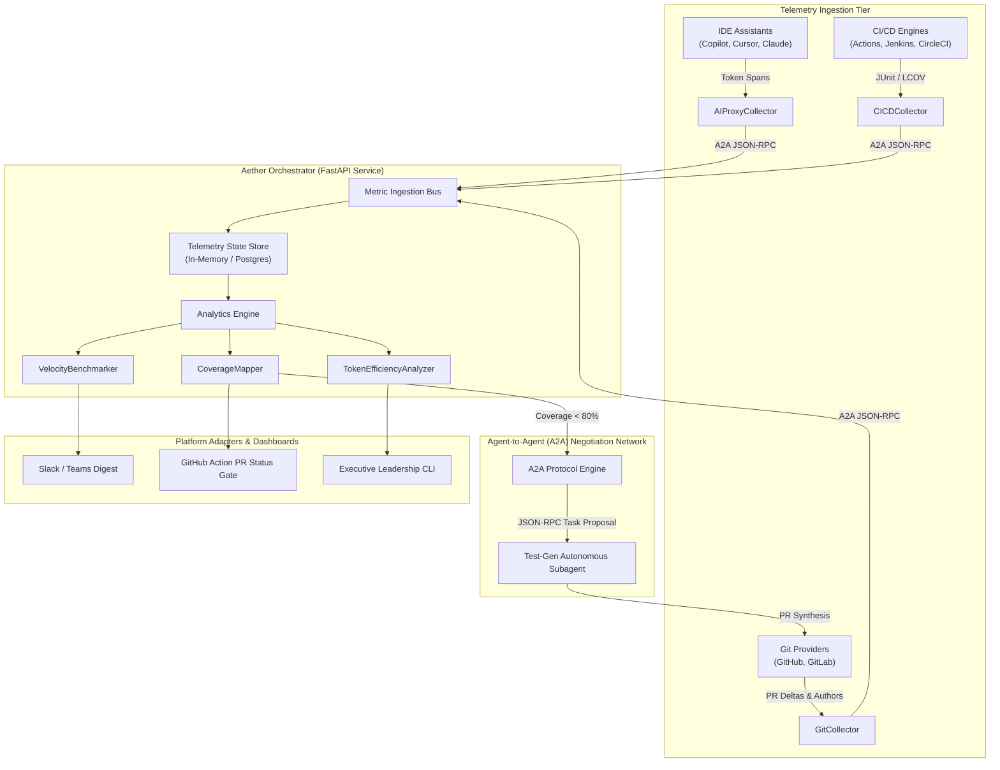
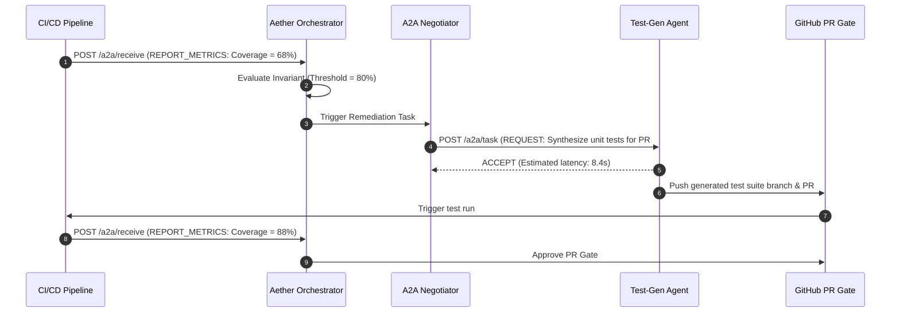

# Aether-Metrics: Engineering AI Governance & Autonomous Velocity Platform ⚡

> **Executive telemetry, DORA augmentation, and Agent-to-Agent (A2A) orchestration to measure, audit, and optimize enterprise AI developer adoption.**

[](https://www.python.org/)
[](https://fastapi.tiangolo.com/)
[](#agent-to-agent-a2a-protocol)
[](#engineering-kpi-taxonomy)
[](LICENSE)

---

## 🧭 Executive Summary & Leadership Thesis

As engineering organizations deploy generative coding assistants (e.g., GitHub Copilot, Cursor, Claude Code), engineering leaders face an acute governance challenge: **distinguishing genuine velocity acceleration from vanity activity and technical debt accumulation.**

Traditional metrics (lines of code generated, commit volume) actively mislead leadership:
- High code generation volume often correlates with higher downstream review latency and increased defect escape rates.
- Blanket seat licensing lacks visibility into token-to-value efficiency across functional categories (refactoring vs. boilerplate vs. test synthesis).
- Quality gates fail to bind test coverage directly to AI-authored features.

**Aether-Metrics** provides engineering executives (VPs, Directors, Heads of Platform) with a vendor-neutral telemetry and autonomous governance control plane. It integrates real-time IDE assistant telemetry, CI/CD pipelines, and version control graphs into unified **DORA + AI ROI indicators**, coupled with an **Agent-to-Agent (A2A) orchestration runtime** that triggers automated remediation when quality or velocity invariants drift.

---

## 📊 Engineering KPI Taxonomy

Aether-Metrics operationalizes four core metric domains:

| KPI Category | Operational Metric | Mathematical Formulation | Leadership Action Trigger |
| :--- | :--- | :--- | :--- |
| **Velocity Delta ($\Delta V$)** | Lead Time & Cycle Time Delta | $\Delta T_{\text{cycle}} = \frac{T_{\text{pre-AI}} - T_{\text{post-AI}}}{T_{\text{pre-AI}}} \times 100$ | Negative delta indicates review bottlenecks or AI code friction. |
| **Token-to-Value Efficiency** | Cost-per-Story-Point Ratio | $\text{TVE} = \frac{\sum \text{Tokens}_{\text{consumed}}}{\text{Story Points Delivered}}$ | Flags runaway token spend on repetitive non-shipping refactors. |
| **AI Attribution vs. Quality** | Defect Escape Correlation | $\text{DE}_{\text{AI}} = \frac{\text{Bugs}_{\text{AI-attributed}}}{\text{Total Incidents}}$ | Triggers mandatory senior peer-review gates on high-risk modules. |
| **Autonomous Coverage Gaps** | Feature-to-Test Mapping | $\text{Cov}_{\text{feat}} = \frac{\text{Tested Feature Paths}}{\text{Total Merged Feature Paths}}$ | Automatically dispatches subagents to synthesize unit tests if $< 80\%$. |

---

## 🏛️ Platform Architecture



---

## 🤖 Agent-to-Agent (A2A) Autonomous Protocol

Unlike passive observability dashboards, Aether-Metrics operates as an **active closed-loop agent**. When the `CoverageMapper` detects a deficit between newly merged code and test suite coverage, it does not merely file a ticket—it negotiates directly with external specialized subagents:



### A2A Message Schema

All inter-agent communication adheres to strict Pydantic contract definitions:

```json
{
  "sender_id": "Collector-Agent-CI-01",
  "recipient_id": "Aether-Orchestrator",
  "request_type": "REPORT_METRICS",
  "payload": {
    "coverage": {
      "repository": "billing-service",
      "microservice": "payment-router",
      "feature_name": "idempotent-stripe-webhook",
      "test_case_count": 14,
      "line_coverage_pct": 74.2,
      "uncovered_lines": [48, 52, 98, 104]
    }
  },
  "timestamp": "2026-10-01T03:00:00Z"
}
```

### 📢 Automated Executive Weekly Digest (Slack / Teams Preview)

```text
━━━━━━━━━━━━━━━━━━━━━━━━━━━━━━━━━━━━━━━━━━━━━━━━━━━━━━━━━━━━━━━━━
📊 AETHER-METRICS EXECUTIVE DIGEST | Week 40 (Oct 2026)
━━━━━━━━━━━━━━━━━━━━━━━━━━━━━━━━━━━━━━━━━━━━━━━━━━━━━━━━━━━━━━━━━
🚀 Velocity Delta (Cycle Time):   -24.8% (Improved from 4.2d to 3.1d)
💡 Token-to-Value Efficiency:     $4.12 per merged story point (-18% MoM)
🤖 AI Adoption Depth:             88% Active Devs (72% Copilot, 28% Cursor)
🛡️ Feature Coverage Invariant:   94.2% across 18 microservices
⚡ A2A Autonomous Remediations:   12 coverage gaps auto-resolved by subagents
━━━━━━━━━━━━━━━━━━━━━━━━━━━━━━━━━━━━━━━━━━━━━━━━━━━━━━━━━━━━━━━━━
⚠️ Risk Anomaly Flagged: Service 'inventory-sync' token consumption surged
   3.4x on repetitive refactor cycles without shipping. Senior review assigned.
━━━━━━━━━━━━━━━━━━━━━━━━━━━━━━━━━━━━━━━━━━━━━━━━━━━━━━━━━━━━━━━━━
```

---

## 📂 Repository Topology

```text
leadership/
├── README.md                      # Executive Platform Specification
└── aether_metrics/
    ├── main.py                    # Service runtime & background collection loop
    ├── requirements.txt           # Production dependencies
    ├── agents/
    │   ├── orchestrator.py        # FastAPI A2A hub and endpoint handlers
    │   └── models.py              # Pydantic schemas (A2AMessage, Metrics)
    ├── collectors/
    │   └── base_collector.py      # Abstract telemetry scrapers (AI usage, Coverage)
    ├── analyzers/                 # Velocity and coverage benchmark engines
    ├── config/                    # Organization and team policy configurations
    └── platform_adapters/         # Slack, GitHub Actions, and CLI output formatters
```

---

## 🚀 Quickstart & Validation

### 1. Environment Initialization

```bash
cd leadership
python3 -m venv .venv && source .venv/bin/activate
pip install -r aether_metrics/requirements.txt
```

### 2. Launch Orchestrator & Run Verification Cycle

The primary entry point initializes the FastAPI A2A listener on port `8000` and launches an asynchronous synthetic collection cycle:

```bash
python3 -m aether_metrics.main
```

Expected output:
```text
INFO:     Started server process [84210]
INFO:     Waiting for application startup.
INFO:     Application startup complete.
INFO:     Uvicorn running on http://0.0.0.0:8000

--- Starting Mock Collection Cycle ---

Received message from Collector-Agent: REPORT_METRICS
Received message from Collector-Agent: REPORT_METRICS
Collection cycle successfully completed. Metrics persisted to telemetry bus.
```

### 3. Query Real-Time Telemetry

```bash
curl -X GET http://localhost:8000/metrics/summary \
  -H "Content-Type: application/json"
```

---

## 🛡️ Security, Privacy & Data Custody

1. **Zero Raw Code Exfiltration:** Collectors scrape metadata, AST hashes, line coverage statistics, and token usage deltas. Proprietary application source code is never ingested into the telemetry bus.
2. **Deterministic Role-Based Auditability:** Every A2A negotiation and task dispatch is cryptographically signed and logged with caller identity, timestamps, and target repositories.
3. **Multi-Tenant Policy Isolation:** Multi-team environments enforce granular boundaries; team metrics and token allocations are isolated per business unit.

---

## 📄 License & Attribution

Distributed under the **MIT License**. Maintained by **Hooman Parta** ([@hoomanp](https://github.com/hoomanp)).
